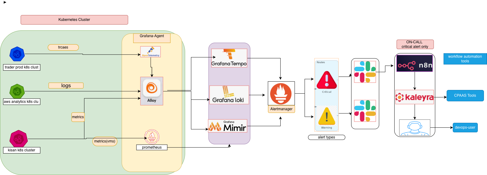

# Grafana Observability Stack


## 🏗️ Architecture
```
Java App → k8s-monitoring (Alloy) → Mimir (Metrics)
    ↓              ↓                     ↓
  Traces         Logs              Long-term Storage
    ↓              ↓                     ↓
  Tempo          Loki               MinIO (S3)
    ↓              ↓                     ↓
    └──── Grafana (Visualization) ────┘
```

## 📁 Components

### 01-grafana/ (v10.1.4)
- **Grafana**: Visualization and dashboards
- **App Version**: 11.4.0
- **Domain**: grafana.spicybiryaniwala.shop
- **Credentials**: admin/admin
- **Features**: Multi-datasource, OAuth, alerting

### 02-mimir/ (v6.0.3)
- **Mimir**: Long-term metrics storage
- **App Version**: 2.14.1
- **Compatible**: Prometheus API
- **Storage**: MinIO S3 (dev) / AWS S3 (prod)
- **Features**: Multi-tenancy, HA, auto-scaling

### 03-tempo/ (v1.56.0)
- **Tempo**: Distributed tracing
- **App Version**: 2.6.1
- **Protocols**: OTLP, Jaeger, Zipkin
- **Storage**: MinIO S3 (dev) / AWS S3 (prod)
- **Features**: TraceQL, service maps, metrics generation

### 04-loki/ (v6.46.0)
- **Loki**: Log aggregation
- **App Version**: 3.3.1
- **Query**: LogQL
- **Storage**: MinIO S3 (dev) / AWS S3 (prod)
- **Features**: Distributed mode, log correlation

### 05-alloy/ (v3.5.6)
- **k8s-monitoring**: Telemetry collection
- **App Version**: 1.5.0
- **Scrapes**: Metrics, logs, traces
- **Agent**: Grafana Alloy
- **Features**: Auto-discovery, OTLP, Kubernetes native

### 06-prometheus/ (v27.45.0)
- **Prometheus**: Metrics collection (optional)
- **App Version**: 2.55.1
- **Scraping**: Kubernetes targets
- **Remote Write**: To Mimir
- **Features**: Alerting, service discovery

### 07-java-app/
- **Spring Boot**: Instrumented application
- **OpenTelemetry**: Traces and metrics
- **Endpoints**: REST API with monitoring

## 🚀 Quick Start

### Prerequisites
```bash
# Add Helm repositories
helm repo add grafana https://grafana.github.io/helm-charts
helm repo add prometheus-community https://prometheus-community.github.io/helm-charts
helm repo update

# Create monitoring namespace
kubectl create namespace monitoring
```

### Complete Installation
```bash
# Make script executable and run
chmod +x install-all.sh
./install-all.sh
```

### Individual Components
```bash
# Grafana (Chart: 10.1.4, App: 11.4.0)
helm install grafana grafana/grafana -f 01-grafana/grafana-values.yml -n monitoring

# Mimir (Chart: 6.0.3, App: 2.14.1)
helm install mimir grafana/mimir-distributed -f 02-mimir/mimir-values.yml -n monitoring

# Tempo (Chart: 1.56.0, App: 2.6.1)
helm install tempo grafana/tempo-distributed -f 03-tempo/tempo-values.yml -n monitoring

# Loki (Chart: 6.46.0, App: 3.3.1)
helm install loki grafana/loki -f 04-loki/loki-values.yml -n monitoring

# k8s-monitoring (Chart: 3.5.6, App: 1.5.0)
helm install k8s-monitoring grafana/k8s-monitoring -f 05-alloy/alloy-values.yml -n monitoring

# Prometheus (Chart: 27.45.0, App: 2.55.1) - Optional
helm install prometheus prometheus-community/prometheus -f 06-prometheus/prometheus-values.yml -n monitoring
```

## 🔗 Access

### Production URLs
- **Grafana**: https://grafana.spicybiryaniwala.shop
- **Requires**: Ingress controller and cert-manager

### Local Access
```bash
# Grafana
kubectl port-forward -n monitoring svc/grafana 3000:80

# Mimir
kubectl port-forward -n monitoring svc/mimir-nginx 8080:80

# Loki
kubectl port-forward -n monitoring svc/loki-gateway 3100:80

# Tempo
kubectl port-forward -n monitoring svc/tempo-query-frontend 3200:3200

# Java App
kubectl port-forward -n monitoring svc/java-app 8080:8080
```

## 📊 Monitoring

### Datasources (Auto-configured)
- **Prometheus**: http://prometheus-server:80
- **Mimir**: http://mimir-nginx:80/prometheus
- **Loki**: http://loki-gateway:80
- **Tempo**: http://tempo-query-frontend:3200

### Dashboards
- Import from `08-dashboards/`
- Java application metrics
- Infrastructure monitoring
- Distributed tracing

## 🧪 Testing

### Java Application
```bash
# Health check
curl http://localhost:8080/actuator/health

# Generate metrics
curl http://localhost:8080/api/users/123

# Create traces
curl -X POST http://localhost:8080/api/orders -d '{"item":"test"}'

# View metrics
curl http://localhost:8080/actuator/prometheus
```

### Verify Stack
```bash
# Check pods
kubectl get pods -n monitoring

# Check services
kubectl get svc -n monitoring

# Check ingress
kubectl get ingress -n monitoring
```

## 🔧 Configuration

### Domain Setup
- Update DNS: `grafana.spicybiryaniwala.shop` → Your IP
- Install cert-manager for TLS
- Configure ingress controller

### Storage
- **Development**: MinIO (ephemeral)
- **Production**: AWS S3, GCS, or Azure Blob

### Security
- Change default passwords
- Configure OAuth (Google, GitHub)
- Set up RBAC policies

## 📈 Scaling

### High Availability
- Increase replicas in values files
- Use persistent storage
- Configure load balancing

### Performance
- Adjust resource limits
- Configure retention policies
- Optimize query performance

## 🎯 Latest Versions (Updated)
- **Grafana**: 10.1.4 (App: 11.4.0)
- **Mimir**: 6.0.3 (App: 2.14.1)
- **Tempo**: 1.56.0 (App: 2.6.1)
- **Loki**: 6.46.0 (App: 3.3.1)
- **k8s-monitoring**: 3.5.6 (App: 1.5.0)
- **Prometheus**: 27.45.0 (App: 2.55.1)

This comprehensive observability stack provides complete monitoring with metrics, logs, and traces for Kubernetes applications using the latest Grafana ecosystem tools.